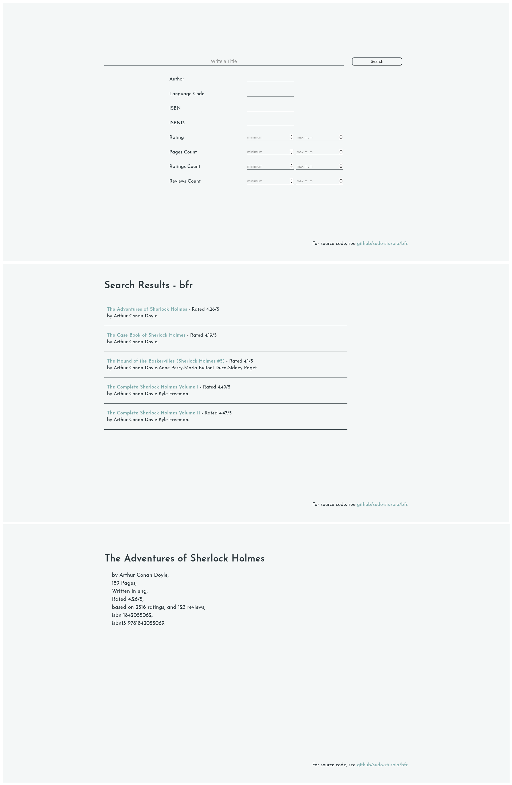

# bfr
bfr, short for book finder, is a book searching web application with a REST API. bfr
is capable of searching for books using their titles or, more interestingly, using a
set of search parameters.

## How To Run?
- Clone the repo using `git clone https://github.com/sudo-sturbia/bfr.git`.
- The programs used to run the servers (frontend and backend) live in `cmd`.
    - For the API use `go run ./cmd/api`.
    - For the frontend `go run ./cmd/frontend`.

## How To Use?
### API
```
A REST API that enables searching for books using a set of parameters.
Usage:
    go run ./cmd/api                 Run a backend server at localhost:6060.
    go run ./cmd/api -dataset path   Load a new csv dataset to use as a datastore, then run the server.
    go run ./cmd/api -port <number>  Use the specified port to run the server.
    go run ./cmd/api -h              Print a help message.

See github.com/sudo-sturbia/bfr.
```

For the first run you must create a new datastore using `-dataset` flag, afterwards
the server uses the last created datastore and can run simply using `bfr`.

For the dataset checkout [goodreads-books](https://www.kaggle.com/jealousleopard/goodreadsbooks),
you can also construct your own dataset as long as its columns match [this sample](test-data/booksTest.csv).

#### Endpoints
##### /book/{id}
```
GET /book/{id}
```
Searchs for a book with the given ID. IDs depend on your dataset.

##### /books/{title}
```
GET /books/{title}
```
Searchs for, and lists all books with this specific title.

##### /books
```
GET /books
```

Searchs for, and lists books (or their titles) based on a set of search parameters. A search
with no parameters lists all available books in the database.

###### Parameters
| Name                  | Type        | In   | Description                                              |
| :-------------------- | :---------- | :--- | :------------------------------------------------------- |
| **TitlesOnly**        | boolean     | URL  | If specifed, returns a list of titles instead of books.  |
| **TitleHas**          | string      | URL  | A sub-string that must exist in the title.               |
| **Authors**           | string list | URL  | Must have one of these authors.                          |
| **LanguageCode**      | string list | URL  | Must be written in one of these languages.               |
| **ISBN**              | string      | URL  | 10 digit ISBN.                                           |
| **ISBN13**            | string      | URL  | 13 digit ISBN.                                           |
| **RatingCeil**        | float <= 5  | URL  | Rating must be less than or equal.                       |
| **RatingFloor**       | float <= 5  | URL  | Rating must be higher than.                              |
| **PagesCeil**         | int         | URL  | Number of pages must be less than or equal.              |
| **PagesFloor**        | int         | URL  | Number of pages must be higher than.                     |
| **RatingsCountCeil**  | int         | URL  | Number of ratings must be less than or equal.            |
| **RatingsCountFloor** | int         | URL  | Number of ratings must be higher than.                   |
| **ReviewsCountCeil**  | int         | URL  | Number of reviews must be less than or equal.            |
| **ReviewsCountFloor** | int         | URL  | Number of reviews must be higher than.                   |

#### Examples
Request:
```console
/books?TitleHas=War&Authors=Leo&PagesFloor=1000&RatingsCountFloor=20000
```

Response:
```json
[
	{
		"ID": 656,
		"Title": "War and Peace",
		"Authors": "Leo Tolstoy-Henry Gifford-Aylmer Maude-Louise Maude",
		"AverageRating": 4.11,
		"ISBN": "192833987",
		"ISBN13": "9780192833983",
		"LanguageCode": "eng",
		"Pages": 1392,
		"RatingsCount": 201919,
		"ReviewsCount": 5903
	}
]
```

Request:
```console
/books?Authors=Jane%20Austen&RatingsCountFloor=10000&TitlesOnly=true
```

Response:
```json
[
	"Pride and Prejudice",
	"Persuasion",
	"Emma",
	"The Complete Novels",
	"Mansfield Park"
]
```

### Frontend
```
A frontend web server that utilizes bfr API to search for and find books.
Usage:
    go run ./cmd/frontend                 Run a frontend server at localhost:5050.
    go run ./cmd/frontend -api <url>      Use given URL for API calls, default is localhost:6060.
    go run ./cmd/frontend -port <number>  Run server at specified port.
    go run ./cmd/frontend -static <path>  Use given path for static files.
    go run ./cmd/frontend -h              Print this help message.

See github.com/sudo-sturbia/bfr.
```

For the frontend to work, the backend must be running.

#### Screenshots


